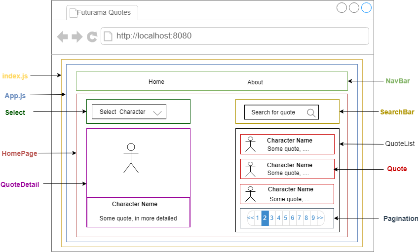

# Challenge: Futurama quotes

## Case Study:
>As a user I want to search for Futurama quotes of my favourite character from the 
Futurama API.

## Description
- The user should be able to select his favourite character
- The user can search quotes from their favourite character


## Breaking the UI Into A Component Hierarchy



## Acceptance Criteria
- You should use react or angular
- You should include at least one test
- UI/UX is up to you

## How to run this app
```shell
> git clone https://github.com/abdoulayebinta/futurama-quotes.git
> cd futurama-quotes
> npm install 
> npm start    # this will open a new tab into your browser with http://localhost:8080/ in development mode 
> npm run build  # for using the production build 
> npm test       # to test the app using Jest
> npm run test:watch    # to run test in watch mode (everytime you save your files, tests will  automatically run) 
> npm run lint          # to run linting using Airbnb React/JSX Style Guide
> npm run lint:write    # to fix minor linting issue
```

## As it is right now
- At first launch, a list of quotes (of all characters) will be fetch from the futurama api.
- User can select their favourite character and a list of quotes related to that particular character will be displayed. Those lists are clickable, which will expand the quotes to a more detail view. 
- User can search for Futurama Quote. Or by using the paginations buttons and reading the quotes
- The select drop dowm button also contain a search (select / search) where user can search for their favourite character without scrolling to the bottom for better user experience.
- The page has a navigation bar using **react-router-dom**

## Fetching Data

- I used [**axios**](https://www.npmjs.com/package/axios) a Promise based HTTP client for the browser and node.js
- Data is loaded in component lifecycle method

## Tech Stack used in this case study
- ReactJS ^16.8.6
- Bootstrap ^4.3.1  - For mobile first approach and responsive design
- Node.js 10.15.3
- Webpack  ^4.36.1  and webpack-dev-server ^3.7.2 - Configured from scracth 
- Jest  ^24.8.0  - For unit testing and integration testing
- CSS             
- Sass (configured but not utilized yet)
- jQuery


